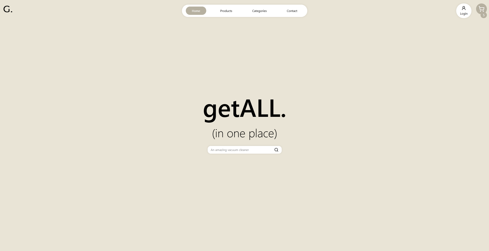

# Get All - E-commerce Platform

[]()

A modern e-commerce web application built with React. Users can browse products, search by category, add items to cart. The app features a responsive design, user authentication, and a clean interface for online shopping. This is fully responsive and optimized for all devices.

## ✨ Features

- **Product Browsing:** Browse through a comprehensive catalog of products with detailed information.
- **Search & Filtering:** Search products by name and filter by categories.
- **Shopping Cart:** Add products to cart, manage quantities, and view total prices.
- **User Authentication:** Secure login system with user session management in localStorage.
- **Responsive Design:** Optimized for desktop, tablet, and mobile devices.
- **Product Details:** Detailed product pages with images, descriptions, and reviews.
- **Category Navigation:** Browse products by different categories.
- **Toast Notifications:** User-friendly notifications for actions and errors.

## 🛠️ Technologies Used

- **Frontend:**

  - React 19
  - Vite (Build tool)
  - React Router DOM (Navigation)
  - Tailwind CSS (Styling)
  - Lucide React (Icons)
  - React Select (Dropdown components)
  - React Toastify (Notifications)
  - Axios (HTTP requests)

- **External APIs:**

  - DummyJSON API (Product data)

- **Development:**
  - ESLint (Code linting)
  - Git (Version control)
  - Vercel (Deployment)

## 🚀 Installation

1. **Clone the repository:**

   ```bash
   git clone https://github.com/Antoinekoe/get-all.git
   cd get-all
   ```

2. **Install dependencies:**

   ```bash
   npm install
   ```

3. **Start the development server:**

   ```bash
   npm run dev
   ```

   The app will be available at `http://localhost:5173`.

4. **Build for production:**

   ```bash
   npm run build
   ```

5. **Preview production build:**

   ```bash
   npm run preview
   ```

## 🗂️ Project Structure

```
get-all/
├── public/                    # Static files
│   └── vite.svg              # Vite logo
├── src/                      # Source code
│   ├── assets/               # Images and static assets
│   │   ├── logo.png          # App logo
│   │   ├── loading.gif       # Loading animation
│   │   └── react.svg         # React logo
│   ├── components/           # Reusable components
│   │   ├── cart/             # Shopping cart components
│   │   │   └── Cart.jsx      # Main cart component
│   │   ├── Categories/       # Category components
│   │   │   ├── CategoryCard.jsx    # Individual category card
│   │   │   └── CategoryGrid.jsx    # Category grid layout
│   │   ├── Layout/           # Layout components
│   │   │   ├── Footer.jsx    # Footer component
│   │   │   └── Menu.jsx      # Navigation menu
│   │   ├── products/         # Product-related components
│   │   │   ├── Product.jsx           # Individual product card
│   │   │   ├── ProductsGrid.jsx     # Product grid layout
│   │   │   ├── Review.jsx           # Product review component
│   │   │   └── SearchSuggestions.jsx # Search suggestions
│   │   └── ui/               # UI components
│   │       ├── AddToCartButton.jsx  # Add to cart button
│   │       ├── Hero.jsx             # Hero section
│   │       ├── Pagination.jsx       # Pagination component
│   │       ├── Rating.jsx           # Rating component
│   │       └── Searchbar.jsx        # Search functionality
│   ├── context/              # React Context providers
│   │   ├── AuthContext.jsx   # Authentication context
│   │   └── CartContext.jsx   # Shopping cart context
│   ├── hooks/                # Custom React hooks
│   │   ├── useAuth.jsx               # Authentication hook
│   │   ├── useCart.jsx               # Cart management hook
│   │   ├── useCategories.jsx         # Categories hook
│   │   ├── useDeleteAllProducts.jsx  # Delete all products hook
│   │   ├── useDeleteSingleProduct.jsx # Delete single product hook
│   │   ├── useGroupedProducts.jsx    # Group products hook
│   │   ├── useHandleClickPlus.jsx    # Handle click plus hook
│   │   └── useTotalPrice.jsx         # Calculate total price hook
│   ├── pages/                # Page components
│   │   ├── Categories.jsx    # Categories page
│   │   ├── CheckoutCart.jsx  # Cart checkout page
│   │   ├── Contact.jsx       # Contact page
│   │   ├── Home.jsx          # Homepage
│   │   ├── Login.jsx         # Login page
│   │   ├── Page404.jsx       # 404 error page
│   │   ├── ProductDetails.jsx # Individual product page
│   │   └── Products.jsx      # Products listing page
│   ├── services/             # API services
│   │   └── DummyAPI.js       # Product API integration
│   ├── utils/                # Utility functions
│   │   └── stringUtils.jsx   # String manipulation utilities
│   ├── App.jsx               # Main app component
│   ├── index.css             # Global styles
│   └── main.jsx              # App entry point
├── package.json              # npm dependencies and scripts
├── package-lock.json         # npm lock file
├── vite.config.js            # Vite configuration
├── eslint.config.js          # ESLint configuration
├── vercel.json               # Vercel deployment config
├── getALL - functionnality table.xlsx  # Project functionality table
├── getall-mockup.pdf         # Project mockup
├── screenshot-git.PNG        # Project screenshot
├── LICENSE                   # License file
└── README.md                 # This file
```

## 🤝 How to Contribute

Contributions are welcome!

1. **Fork the repository.**
2. **Create a branch for your feature or fix:**
   ```bash
   git checkout -b feature/my-new-feature
   # or
   git checkout -b bugfix/bug-fix
   ```
3. **Make your changes and commit with a clear message.**
4. **Push your branch to your fork:**
   ```bash
   git push origin feature/my-new-feature
   ```
5. **Create a pull request to the `main` branch of the original repository.**

## 🔧 Potential Improvements (TODO)

- Add user registration and profile management
- Implement a wishlist feature
- Add product reviews and ratings system
- Create an admin panel for product management
- Add payment gateway integration (Stripe, PayPal)
- Implement order tracking and history
- Add email notifications for orders
- Create a recommendation system based on user behavior
- Add product comparison feature
- Implement advanced search filters (price range, brand, etc.)
- Add social media sharing for products
- Create a mobile app version
- Add multi-language support
- Implement dark mode theme
- Add product image gallery with zoom functionality

## 🚀 Deployment

The project is configured for deployment on Vercel:

1. **Connect your GitHub repository to Vercel**
2. **Vercel will automatically detect the Vite configuration**
3. **Deploy with one click**

The app is also ready for deployment on other platforms like Netlify, Railway, or any static hosting service.

## 🔑 License

This project is licensed under the MIT License - see the [LICENSE](LICENSE) file for details.
